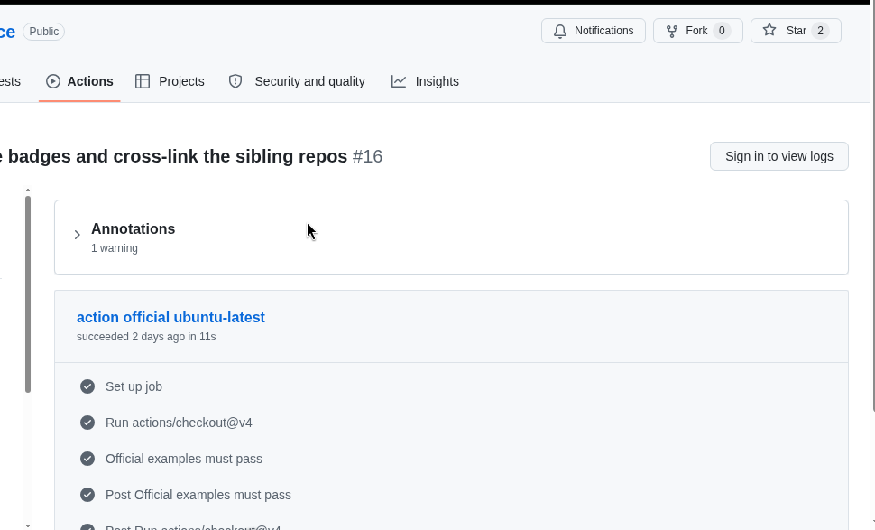
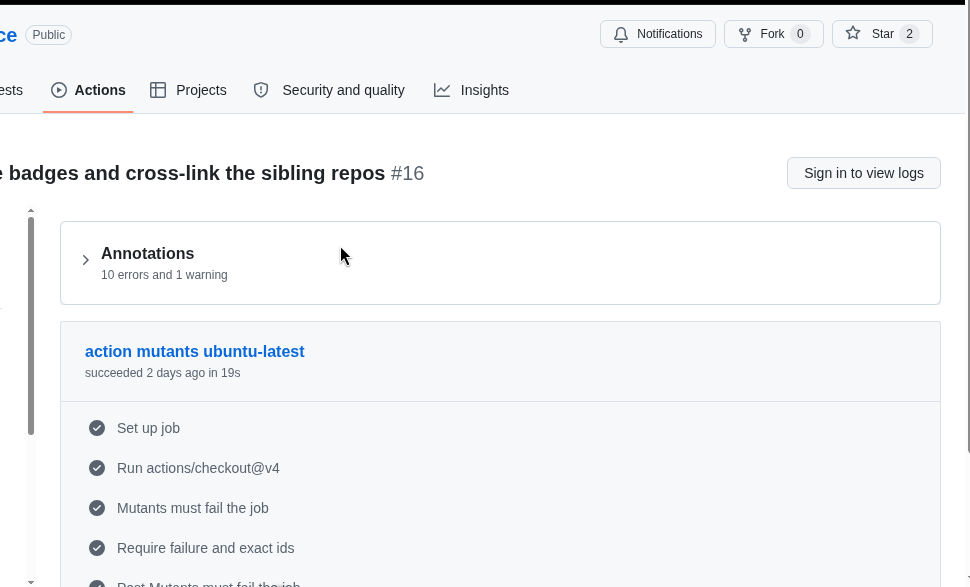

# Validate EN16931 e-invoice

[](https://github.com/facturxapi/validate-einvoice/actions/workflows/selftest.yml) [](https://github.com/facturxapi/validate-einvoice/actions/workflows/upstream-drift.yml) [](https://github.com/marketplace/actions/validate-en16931-e-invoice)

GitHub Action that runs the official ConnectingEurope EN16931 1.3.16
XSLT artefacts (CII and UBL) on XML invoices and reports every
`svrl:failed-assert`.

A green job means: the vendored 1.3.16 stylesheets produced zero
`svrl:failed-assert` on the files you passed. The Action does not call
a remote API, does not read PDF attachments, and does not certify a
document.

## Usage

```yaml
- uses: facturxapi/validate-einvoice@v1
  with:
    files: invoices/**/*.xml
```

Pin a full commit SHA instead of `@v1` if you need a frozen tree.

Copy-paste workflow: [`examples/validate-invoices.yml`](examples/validate-invoices.yml).

## Public self-test (24 Aug 2026)

Same pin as `@v1` (`b364f7c3`). One green workflow: official examples
pass; mutants make the Action step fail (expected).

- Run: https://github.com/facturxapi/validate-einvoice/actions/runs/32736104158
- Official examples (ubuntu): [job](https://github.com/facturxapi/validate-einvoice/actions/runs/32736104158/job/97459169913)
- Mutants must fail the Action step (ubuntu): [job](https://github.com/facturxapi/validate-einvoice/actions/runs/32736104158/job/97459170443)





## Which FacturX repo should I use?

- [validate-einvoice](https://github.com/facturxapi/validate-einvoice) — GitHub Action that runs the official ConnectingEurope EN16931 1.3.16 XSLT artefacts (CII/UBL).
- [en16931-oracles](https://github.com/facturxapi/en16931-oracles) — Replayable fixtures, receipts and mutants for that same 1.3.16 pin.
- [awesome-einvoicing](https://github.com/facturxapi/awesome-einvoicing) — Sourced map of specs, validators, libraries and corpora. Inclusion is not a ranking.

## Local path / `fail-on`

When this repository is checked out as the workflow repo (or vendored):

```yaml
- uses: ./
  with:
    files: invoices/**/*.xml
```


```yaml
# Default — any svrl:failed-assert fails the job
- uses: facturxapi/validate-einvoice@v1
  with:
    files: invoices/**/*.xml
    fail-on: failed-assert

# Report only — the job stays green, the JSON still lists every id
- uses: facturxapi/validate-einvoice@v1
  with:
    files: invoices/**/*.xml
    fail-on: never

# Fail only if one of these rule ids fires
- uses: facturxapi/validate-einvoice@v1
  with:
    files: invoices/**/*.xml
    fail-on: BR-CO-15,BR-02
```

## Inputs

| Name | Required | Default | Meaning |
|---|---|---|---|
| `files` | yes | — | Glob(s) of XML invoices, relative to the workspace. Separate several globs with a newline or a comma. Zero matches fail the job (exit 2). |
| `syntax` | no | `auto` | `auto` reads the document-element namespace. `cii` / `ubl` force one syntax and fail if the document does not match. |
| `fail-on` | no | `failed-assert` | `failed-assert`: any `svrl:failed-assert` fails the job. `never`: report only. Comma-separated ids: fail only if one of those ids fires. |
| `version` | no | `1.3.16` | Only the vendored 1.3.16 artefacts are shipped. Any other value is a configuration error. |

## Outputs

| Name | Meaning |
|---|---|
| `verdict` | `pass` or `fail` |
| `failed-count` | Number of files with at least one `svrl:failed-assert` |
| `report` | Canonical JSON report (stable keys, no timestamps) |
| `report-sha256` | SHA256 of that JSON |
| `report-path` | Workspace-relative path of the written file (`en16931-report.json`) |

Each file in the JSON has: `path`, `syntax`, `verdict`,
`failed_assert_count`, `failed_assert_ids`, `sha256`, `xslt`,
`xslt_sha256`.

The job also writes GitHub annotations (`::error file=…,title=<id>::`)
and a markdown table on the job summary. Invoice bytes are never logged.

## Reproducibility

The oracle is the pair of official XSLT files, hashed on every run.
A different stylesheet is a different oracle; pins are not auto-updated.

| Syntax | Vendored file | SHA256 |
|---|---|---|
| CII | `vendor/en16931-1.3.16/xslt/EN16931-CII-validation.xslt` | `0b234dea2bbfee739b7761e607a992c17fab88773014ef56355b6158cfb1cc53` |
| UBL | `vendor/en16931-1.3.16/xslt/EN16931-UBL-validation.xslt` | `39f9d282867f1a49e7708d9e29a53da89643e1ee56f10cec1ebcf1277595fcbd` |

Source of those octets: ConnectingEurope
`eInvoicing-EN16931` tag `validation-1.3.16`
(`en16931-cii-1.3.16.zip` / `en16931-ubl-1.3.16.zip`, inner path
`xslt/EN16931-*-validation.xslt`). Machine-readable pins:
[`vendor/upstream.json`](vendor/upstream.json).

The weekly workflow [`.github/workflows/upstream-drift.yml`](.github/workflows/upstream-drift.yml)
re-downloads the latest CII/UBL release and fails if the tag or the
XSLT hashes moved. It never rewrites the pins.

Engine pin: `saxonche==13.0.0` (SaxonC-HE 13.0). The JSON report is
canonical (`sort_keys`, no timestamps, relative paths). Two consecutive
runs of the same files must produce the same `report-sha256`.

`auto` maps:

- `urn:un:unece:uncefact:data:standard:CrossIndustryInvoice:100` → CII
- `urn:oasis:names:specification:ubl:schema:xsd:Invoice-2` or `…CreditNote-2` → UBL

## Local self-test (no GitHub)

```bash
python3 scripts/selftest.py
```

On POSIX you can also run `./scripts/selftest.sh`. Both install
`saxonche==13.0.0`, check the 10 official examples (must be green),
check the 10 mutants (must be red with the ids in
`testdata/MUTANTS.md`), compare two consecutive report hashes, run the
unit tests, and run the identity gate. Any difference is a failure.

## What this does not claim

- Not a national CIUS (France, XRechnung profile, Peppol BIS, …).
  `XRechnung-O.xml` is an official EN16931 category-O example, not a
  CIUS proof.
- Not Factur-X / ZUGFeRD packaging, not PDF/A-3, not veraPDF.
- Not a certification and not a product benchmark.
- Not an official ConnectingEurope Action. It only runs the official
  ConnectingEurope EN16931 1.3.16 XSLT artefacts.

## Licence

EUPL 1.2 for this Action. The vendored XSLT and the official examples
are ConnectingEurope EN16931 `validation-1.3.16`, also EUPL 1.2,
unmodified. Mutants are modified copies (see `NOTICE`).

## See also

- [awesome-einvoicing](https://github.com/facturxapi/awesome-einvoicing) — sourced map of EN16931 / Factur-X / ZUGFeRD / XRechnung specs, validators, and corpora.
- [en16931-oracles](https://github.com/facturxapi/en16931-oracles) — test invoices with signed expected verdicts, aligned with the Commission's ITB validator (16/16). Useful as CI fixtures for this Action.
- For PDF/A-3 (Factur-X/ZUGFeRD) container checks, repair, and the French CTC profile: [facturxapi.com/docs](https://facturxapi.com/docs).
- Walkthrough: adding the official 1.3.16 XSLT to GitHub Actions (YAML, BR-* codes, fixtures that must fail): https://facturxapi.com/blog/valider-ci-github-actions
